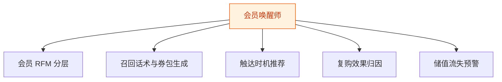
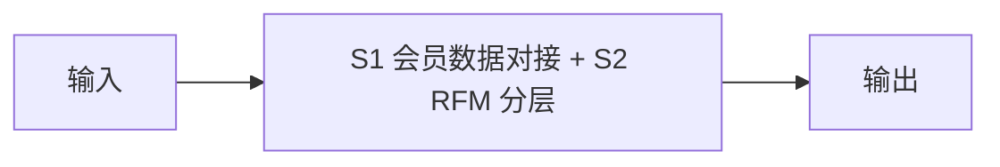
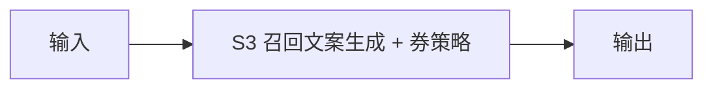
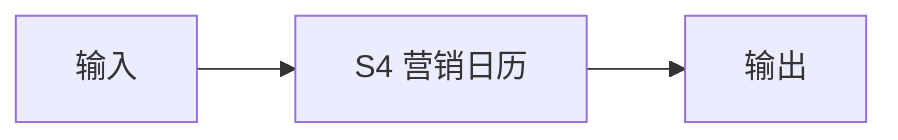
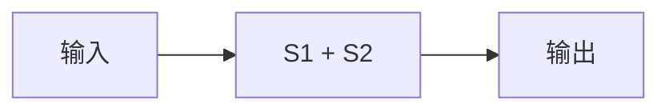
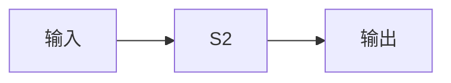

# 会员唤醒师 — 工作流流程图

本员工共 **5 条工作流**，下辖 **4 个原子技能**。

## 总览

## 分条详情

### 会员 RFM 分层

| 项目 | 内容 |
|------|------|
| 触发 | 定时（每周） |
| 复杂度 | `M` |
| 阶段 | `P1` |
| ROI | 替代手工翻账本，月省 6 小时 |

### 召回话术与券包生成

| 项目 | 内容 |
|------|------|
| 触发 | 随 W1 联动 |
| 复杂度 | `S` |
| 阶段 | `P1` |
| ROI | 复购率+10pct ≈ 月增 5000 营收 |

### 触达时机推荐

| 项目 | 内容 |
|------|------|
| 触发 | 定时（每日） |
| 复杂度 | `S` |
| 阶段 | `P1` |
| ROI | 提升打开率，减少骚扰反感 |

### 复购效果归因

| 项目 | 内容 |
|------|------|
| 触发 | 定时（每月） |
| 复杂度 | `M` |
| 阶段 | `P2` |
| ROI | 让召回动作可优化而非玄学 |

### 储值流失预警

| 项目 | 内容 |
|------|------|
| 触发 | 定时（每周） |
| 复杂度 | `S` |
| 阶段 | `P1` |
| ROI | 储值客户流失=现金流流失，预警即止损 |

## 汇总表

| # | 工作流 | 阶段 | 复杂度 | 触发 | 涉及技能数 |
|---|--------|------|--------|------|-----------|
| 1 | 会员 RFM 分层 | `P1` | `M` | 定时（每周） | 1 |
| 2 | 召回话术与券包生成 | `P1` | `S` | 随 W1 联动 | 1 |
| 3 | 触达时机推荐 | `P1` | `S` | 定时（每日） | 1 |
| 4 | 复购效果归因 | `P2` | `M` | 定时（每月） | 1 |
| 5 | 储值流失预警 | `P1` | `S` | 定时（每周） | 1 |

---

*本图由 build_p0_assets.py 自动生成*
