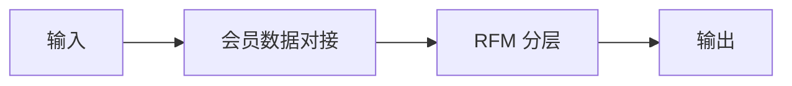

# 复购效果归因

## 元信息

| 字段 | 值 |
|------|-----|
| ID | `de_local_06_wf04` |
| 类型 | **`composite`（复合技能）** |
| 所属员工 | 会员唤醒师 |
| 阶段 | `P2` |
| 复杂度 | `M` |
| 触发方式 | 定时（每月） |
| ROI | 让召回动作可优化而非玄学 |
| 资产形态 | 提示词 + 编排脚本（`scripts/run_flow.py`） |

> 复合技能 = 工作流。它把多个**原子技能**按业务顺序编排在一起，完成一个完整场景。

## 能力描述

串联「会员数据对接 → RFM 双快照对比 + 链路归因」，对召回活动做「触达 → 领券 → 到店核销 → 复购」全链路归因：核销率精确到整数百分比，增量毛利 = Σ核销消费 × 毛利率（精确到 0.1 元），券成本 = 核销人数 × 面额，ROI = 增量毛利 ÷ 券成本（保留 2 位小数）；召回前后双快照按 R 40% / F 30% / M 30% 统一口径对比，产出分层迁移与 ≤3 条话术迭代建议。配套 `scripts/run_flow.py` 可确定性复现（`--demo` 一键跑通，产物落 `out/`）。

## 编排的原子技能

| # | 原子技能 | 能力 |
|---|---------|------|
| 1 | [会员数据对接](../../skills/member-data-sync/) | 收银/会员系统数据读取（BusinessConnector） |
| 2 | [RFM 分层](../../skills/rfm-segmentation/) | 三维打分与分桶 |

## 步骤链路（DAG）

## 步骤明细

| # | 步骤 | 技能资产 | 输入 | 输出 | 失败处理 |
|---|------|---------|------|------|---------|
| 1 | 会员数据对接 | [`../../skills/member-data-sync/`](../../skills/member-data-sync/) | 上一步输出 | 会员数据对接 输出 | 记录错误并中止 |
| 2 | RFM 分层 | [`../../skills/rfm-segmentation/`](../../skills/rfm-segmentation/) | 上一步输出 | RFM 分层 输出 | 记录错误并中止 |

## 步骤说明

召回→到店核销链路归因 → 话术迭代

## 输入规格

| 字段 | 类型 | 必填 | 说明 |
|------|------|------|------|
| `input` | string / object | ✅ | 工作流初始输入，由触发条件提供 |

## 输出规格

| 字段 | 类型 | 说明 |
|------|------|------|
| `summary` | string | 执行摘要 |
| `steps` | string | 分步结果 |
| `deliverable` | string | 最终交付物 |

## 使用步骤

### 方式一：AI 逐步编排（纯提示词）

1. 打开任意支持自定义提示词的 AI 工具
2. 复制 `prompt.txt` 的**全部内容**作为系统提示词
3. 按「输入规格」提供 `input` 数据（参考 `examples/input.json` 的真实格式）
4. 按执行步骤逐步产出，最终交付物带 AI 生成标识并经人工确认

### 方式二：确定性脚本一键复现

1. 运行 `python scripts/run_flow.py --demo`（内置演示数据），或
   `python scripts/run_flow.py --input examples/input.json`
2. 脚本按 SKILL.md 步骤链路逐节点编排（每步读上一步产物），无需任何模型调用
3. 在 `out/` 下获取真实产物：`out/字段映射.csv`、`out/归因明细.csv`、`out/attribution_result.json`、`out/归因报告.md`
4. 与 AI 输出交叉复核，差异项回查口径

## 错误处理

| 情况 | 处理方式 |
|------|---------|
| 输入缺失 | 提示缺少的字段，终止流程 |
| 中间步骤输出不合规 | 合规技能拦截，返回修改建议，不继续下游 |
| 提示词被平台截断 | 拆分任务，分两次处理 |

## 验收标准

- [ ] 每一步的技能资产齐全（SKILL.md / prompt.txt / schema.json）
- [ ] 步骤间输入输出字段可衔接
- [ ] 末步输出带 AI 生成标识
- [ ] 全流程有人工确认环节

## 在平台上的编排方式

| 平台 | 编排方式 |
|------|---------|
| **Coze / 扣子** | 新建工作流 → 按步骤添加节点，每个节点填入对应技能的 prompt.txt |
| **Dify** | 新建 Workflow → 添加 LLM 节点链，按 DAG 顺序连接 |
| **WorkBuddy** | 新建 Skill，按步骤在指令中串联各技能提示词 |
| **手动使用** | 按步骤顺序，逐个把 prompt.txt 与上一步输出交给 AI |

## 边界（不做的事）

- ❌ 不把相关性当因果——结论注明可能混杂因素（季节、活动叠加）
- ❌ 不擅改双快照口径——与活动前分层完全一致，不一致即终止
- ❌ 不编造未抽样的全量数据——全量仅按抽样比例估算并标注
- ❌ 不把归因结论用作对外宣传素材
- ❌ 不在指标口径未锁定时输出 ROI

## 调用示例

**输入**（`examples/input.json`）：2026 年 9 月 20 元洗剪吹召回券，触达 30 名、
抽样跟踪 6 名，毛利率 55%。

**输出**（脚本实跑）：核销 3/6（50%），增量毛利 249.7 元，券成本 60 元，
ROI 4.16；孙悦 156→升级、李强/刘洋持平、陈伟/赵磊/周婷未核销未迁移；
话术迭代建议 3 条落 `out/归因报告.md`。

## 所属工作流

本资产为复合技能（工作流），是独立的端到端流程；下游可接 `winback-script-coupon-flow`（按归因发现迭代话术与券面额）。

## 合规声明

- 本工作流输出为 **AI 辅助生成内容**，交付前必须经人工审核
- 请按所在平台要求完成 AI 生成内容标识
- 涉及专业领域（法律 / 税务 / 医疗）的内容仅作参考，不构成专业意见

---

*本复合技能定义由 build_p0_assets.py 生成*
